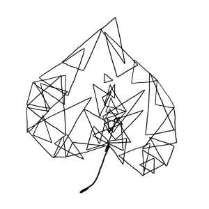

Play is the primary context for infant learning and is foundational for all domains of healthy development—cognition, language, social interaction, motor action, and emotion. Before children begin formal schooling, play occupies nearly all of their waking day. In the first years of life, play provides an unparalleled window into typical and atypical patterns of development, and it is an ideal context for understanding development in children around the globe.

Video uniquely captures the nuances and details of natural behavior and the surrounding context, and video can be used and reused by experts in multiple domains.

# The Play & Learning Across a Year (PLAY) project 

PLAY is a collaborative research initiative by 65 researchers from 45 universities across the United States and Canada.
PLAY focuses on recording and revealing the behaviors of infants and mothers during natural activity in their homes, providing an unprecedented corpus of data, and using an innovative, transparent approach to science.
The data set will consist of fully transcribed and annotated videos, parent report questionnaires, video tours of the home, digital recordings of ambient noise, and detailed demographic information on 900+ infants and mothers from across the United States. 
This first-of-its-kind corpus will be shareable and searchable with data spanning domains from language to locomotion, gender to gesture, and object play to emotion.

## Support

PLAY is supported by grants from the Office of the Director, National Institutes of Health, (OD), Eunice Kennedy Shriver National Institute for Child Health and Human Development (NICHD), the National Institute of Mental Health (NIMH), and the National Institute on Drug Abuse (NIDA) under R01HD094830-01, the LEGO Foundation, and the Alfred P. Sloan Foundation.
