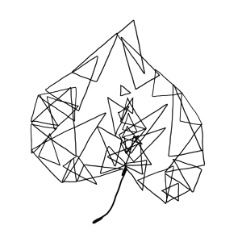

```{r child = 'phone_questionnaire.Rmd'}
```

```{r child = 'toys_pets.Rmd'}
```

```{r child = 'ecbq.Rmd'}
```

```{r child = 'home.Rmd'}
```

```{r child = 'gender.Rmd'}
```

```{r child = 'locomotor_milestones.Rmd'}
```

```{r child = 'typical_day.Rmd'}
```
